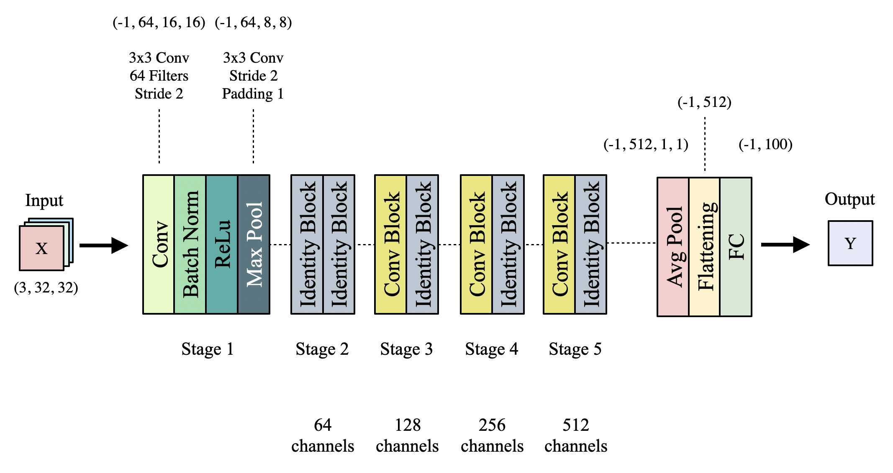
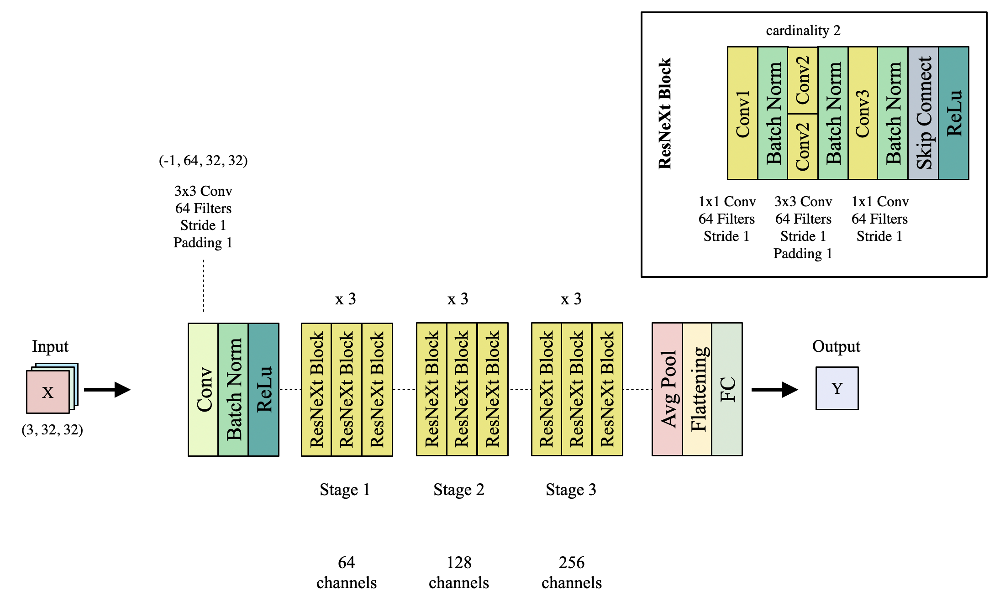

# (LVI) CIFAR-100 Image Classification
[](https://opensource.org/licenses/MIT)
[](https://www.python.org/downloads/release/python-3117/)
[](https://pytorch.org/)

This project implements various image classification models for 
the CIFAR-100 dataset, including ResNet, ResNeXt, ViT, 
Swin Transformer, PyramidNet, and EfficientNet. 
It was developed as part of the Learning Vision Intelligence (LVI) 
course project.


## Table of Contents

- [Overview](#overview)
- [Getting Started](#getting-started)
  - [Prerequisites](#prerequisites)
  - [Installation](#installation)
  - [Random Seed](#randomseed)
- [Usage](#usage)
- [Dataset](#dataset)
- [Model Architectures](#model-architectures)
- [Training](#training)
- [Results](#results)
- [Team Members](#team-members)
- [License](#license)

## Overview

The CIFAR-100 dataset consists of 60,000 32x32 color images 
in 100 classes. This project, developed as part of the Learning 
Vision Intelligence (LVI) course, 
aims to develop and compare high-performance image classification 
models using various state-of-the-art architectures.

## Getting Started

### Prerequisites

- Python 3.11.7
- PyTorch 2.1.2+cu121
- CUDA-capable GPU (recommended)
- For other required libraries, please refer to the requirements file

### Installation

1. Clone the repository:
   ```sh
   git clone https://github.com/bigeco/lvi-cifar100-classifier-pytorch.git
   cd lvi-cifar100-classifier-pytorch
   ```

2. Install the required packages:
   ```sh
   pip install -r requirements.txt
   ```

### Random Seed

To ensure reproducibility, we use a fixed random seed. The default random seed is set to 42.
To change the random seed, use the `--seed` argument when running the training script:

```sh
python src/train.py --seed 123 [other arguments]
```

We use the following code to set the random seed:

```python
import os
import torch
import numpy as np
import random

def seed_everything(seed):
    random.seed(seed)
    os.environ['PYTHONHASHSEED'] = str(seed)
    np.random.seed(seed)
    torch.manual_seed(seed)
    torch.cuda.manual_seed(seed)
    torch.backends.cudnn.deterministic = True
    torch.backends.cudnn.benchmark = True

def main(args):
    seed_everything(args.seed)  # Seed 고정
```

This function is called at the beginning of our training script to ensure consistent results across runs.


## Usage

To train the model:

### 1. ResNet9
```sh
python src/train.py --model_name "resnet9" --epochs 240 --batch_size 128 --optimizer_name "Adam" --lr 0.005 --scheduler_name "OneCycleLR" --select_transform ('RandomCrop', 'RandomHorizontalFlip', 'ColorJitter') --mixup True
```

### 2. ResNet18
```sh
python src/train.py --model_name "resnet18" --epochs 100 --batch_size 64 --optimizer_name "AdamW" --lr 0.008 --criterion_name "LabelSmoothingLoss" --scheduler_name "OneCycleLR" --select_transform ('RandomCrop', 'RandomHorizontalFlip', 'ColorJitter') --mixup True --split True --train_ratio 0.8
```

### 3. ResNeXt50
```sh
python src/train.py --model_name "resnext50" --epochs 100 --batch_size 64 --optimizer_name "Adam" --lr 0.001 --select_transform ('RandomCrop', 'RandomHorizontalFlip', 'ColorJitter') --mixup True --split True --train_ratio 0.8
```

### 4. Densenet201
```sh
python src/train.py --model_name "densenet201" --epochs 100 --batch_size 64 --optimizer_name "Adam" --lr 0.001 --select_transform () --split True --train_ratio 0.8
```

### 5. WideResNet28_10
```sh
python src/train.py --model_name "wide_resnet28_10" --epochs 100 --batch_size 64 --optimizer_name "Adam" --lr 0.001 --select_transform ('RandomCrop', 'RandomHorizontalFlip', 'ColorJitter') --mixup True --split True --train_ratio 0.8
```

### 6. ViT
```sh
python src/train.py --model_name "vit" --epochs 100 --batch_size 64 --optimizer_name "Adam" --lr 0.001 --select_transform () --split True --train_ratio 0.8
```

### 7. Swin
```sh
python src/train.py --model_name "swin6" --epochs 100 --batch_size 64 --optimizer_name "AdamW" --lr 0.001 --weight_decay 0.05 --scheduler_name "CosineAnnealingLR" --eta_min 1e-6 --select_transform ('RandomCrop', 'RandomHorizontalFlip') --split True --train_ratio 0.8
```

### 8. PyramidNet110 with Shake-Drop (Best Top-1) 
```sh
python src/train.py 
```


To predict and print test accuracy of the model:

```sh
python src/evaluate.py --model-path "path/to/saved/model.pth"
```

## Dataset

The CIFAR-100 dataset is automatically downloaded by the PyTorch `torchvision` library. It includes:
- 50,000 training images
- 10,000 testing images
- 100 classes
- 32x32 pixel resolution

## Model Architecture

### ResNet18 Architecture


### ResNeXt29 Architecture 


### PyramidNet110 Architecture


## Training for Best Top-1 accuracy

We implemented PyramidNet with ShakeDrop regularization 
and achieved the highest top-1 accuracy of 83.93% among all models 
on the CIFAR-100 dataset.

- **Optimizer**: SGD
- **Learning Rate**: 0.1 with MultiStep and ReduceLROnPlateau
- **Batch Size**: 128
- **Epochs**: 200
- **Data Augmentation**: Random crop, Random horizontal flip, Cutout
- **loss function**: LabelSmoothingLoss

## Result
PyramidNet with Shake-Drop achieved Best Top-1 accuracy 

| Model       | Loss | Top-1 Accuracy | Top-5 Accuracy | Super Top-1 Accuracy |
|-------------|------|----------------|----------------|----------------------|
| PyramidNet  | 1.31 | 83.98%         | 97.09%         | 91.13%               |


## Team Members

This project was developed collaboratively by the following team members:

<a href="https://github.com/bigeco/lvi-cifar100-classifier-pytorch/graphs/contributors">
  
</a>

- **Lee Songeun**
  - Role: 
    
    implement
    
    - utils(e.g. top-k accuracy function, train/valid utils) and CifarDataset class
    - models(e.g. ResNet9, ResNet56, ResNet110, Swin, PyramidNet with Shake Drop, Wide-ResNet)
    - lr scheduler (OneCycleLR, LambdaLR, StepLR, CosineAnnealingLR, CosineAnnealingWarmRestarts)

  - GitHub: [@bigeco](https://github.com/bigeco)


- **Park Jihye**
  - Role: 

    implement 

    - models(e.g. EfficientNet, ResNet18, ResNeXt50, DenseNet201) 
    - augmentation(rotation, flipping)
    - Loss functions(Focal Loss and Label Smoothing Loss functions)

  - GitHub: [@park-ji-hye](https://github.com/park-ji-hye)


- **Song Daeun**
  - Role:
  
    implement
    
    - models(e.g. ResNet, ResNeXt, ViT)
    - augmentation(Mixup, Color Jittering, Cutout, AutoAugment)
    - Modifying Model(Resnet, ResNeXt baseline)

  - GitHub: [@Song-Daeun](https://github.com/Song-Daeun)


## License

This project is licensed under the MIT License - see the [LICENSE](LICENSE) file for details.
